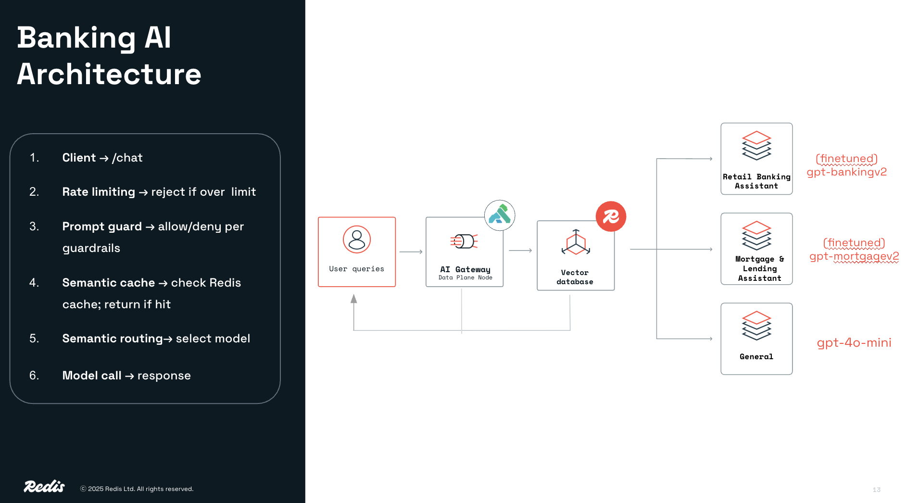
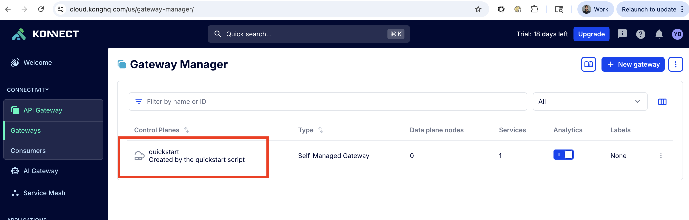
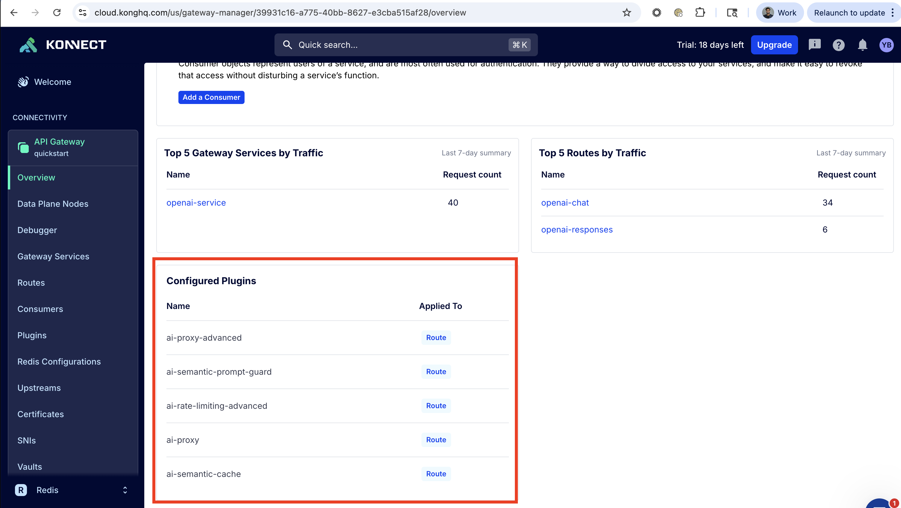

# Redis-Powered Kong AI Gateway

This repository demonstrates Kong AI Gateway's capabilities powered by Redis high-performance vector database.

The demo configures:

- AI Proxy Advanced (semantic routing to multiple models)
- AI Semantic Cache
- AI Semantic Prompt Guard
- AI Rate Limiting Advanced

The demo uses two fine-tuned OpenAI models:
- Retail Banking Assistant ("Anna")
- Mortgage & Lending Assistant ("Lisa")





Data plane runs locally in Docker; control plane is Kong Konnect. Insomnia is optional for making requests.

## Prerequisites

- Redis Cloud database
- Kong Konnect account (Access Token)
- OpenAI (API key + Models)
- Docker Desktop
- Insomnia

## 1) Konnect setup

Sign in: https://cloud.konghq.com/login

Create a Personal Access Token: Profile → Personal Access Tokens → Generate New Token.

Note the token down 

## 2) Redis Cloud setup

Sign up for a **free** Redis Cloud account: https://cloud.redis.io/#/

1. Create your free account (no credit card required)
2. Create a new database:
   - Select **Redis 8.0**
   - Choose your preferred tier (Free tier available with 30MB storage)
3. Once created, note the connection details from the database dashboard:
   - **Public endpoint host**
   - **Port**
   - **Default user password**

## 3) OpenAI setup

### Create API Key

Create an API key: https://platform.openai.com/api-keys
Note it down.

### Fine-tune Models

Two specialized models are required for this demo: a Retail Banking Assistant and a Mortgage & Lending Assistant.

Access Fine Tune Models: https://platform.openai.com/finetune

## 4) Configure environment

```bash
git clone <repo-url>
cd kong-ai-gateway-demo

cp .env.example .env
# Edit .env and set:
# - DECK_KONNECT_TOKEN=<your Konnect PAT>
# - OPENAI_API_KEY=<your OpenAI key>
# - OPEN_AI_BANKING_CX_MODEL_NAME=<your retail FT model id>
# - OPEN_AI_MORTGATE_ASSISTANT_MODEL_NAME=<your mortgage FT model id>
# - REDIS_HOST=<redis host>
# - REDIS_PORT=<redis port>
# - REDIS_USERNAME=<redis username, e.g. default>
# - REDIS_PASSWORD=<redis password>
```

## 5) Bootstrap

```bash
chmod +x scripts/*.sh
bash ./scripts/bootstrap.sh
```

Bootstrap will:

- Start the local data plane in Docker
- Apply kong/kong.yaml to Konnect
- Enable /chat with the four plugins

## 6) Verify
### Docker
Verify container named kong-quickstart is running.

### Kong Gateway
1. Verify Gateway "quickstart" exists in Kong Konnect 

1. Verify all Plugins exist on "quickstart" gateway in Kong Konnect 


## 8) Demo with Insomnia 

Import a pre-built Insomnia collection with all demo calls configured (routing, semantic cache, prompt guard, and rate limiting).

**Download:** [Insomnia collection JSON](insomnia_kong_redis_banking_demo.json)

### Import Steps
1. Open **Insomnia**
2. **Application → Preferences → Data → Import Data → From File**
3. Select `insomnia_kong_redis_banking_demo.json`
4. Configure environment variables:
  - `base_url` → `http://localhost:8000`
  - `openai_api_key` → your OpenAI project key (`sk-proj-...`)

### Included Requests
1. **Routing → Retail Banking** (`/responses`)
2. **Routing → Mortgage** (`/responses`)
3. **Semantic Cache → Original** (`/chat`)
4. **Semantic Cache → Near-Duplicate (cache HIT)** (`/chat`)
5. **Prompt Guard → Off-topic (blocked)** (`/chat`)
6. **Rate Limiting → Force 429** (`/chat` with `x-prompt-count`)

## Common adjustments

Apply any changes in Kong.yaml via script:

```bash
bash ./scripts/apply.sh
```

## References

- Kong AI Gateway: https://developer.konghq.com/ai-gateway/
- AI Proxy Advanced: https://developer.konghq.com/plugins/ai-proxy-advanced/
- Semantic Cache: https://developer.konghq.com/plugins/ai-semantic-cache/
- Semantic Prompt Guard: https://developer.konghq.com/plugins/ai-semantic-prompt-guard/
- AI Rate Limiting Advanced: https://developer.konghq.com/plugins/ai-rate-limiting-advanced/
- decK: https://docs.konghq.com/deck/
